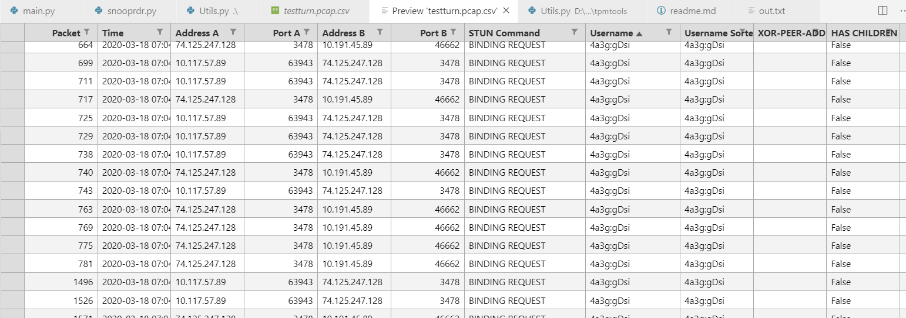

[Prototype Readme.md]

STUN TOOL:
- place your captures in a folder where `stundump.exe` is
- double click `stundump.exe` or run from shell
- known issues: you may see `invalid TCP dump header` this is `dpkt` library bug, so sorry :) 
  
  ==
  example view:
  

[TODO]:
- add User,Pass,Host,Port as a `json` fields
- Add options to select other fields rather `participants`

[example json file]:
```
{
  "session1": {
    "session": {
      "login": null, 
      "queries": []
    }
  }, 
  "session2": {
    "session": {
      "login": "10.164.76.246:8888:hive", 
      "queries": [
        "select * from kafka_events_12 where product_type = 'VOIP' and topic = 'mcapi.avro.pri.decoded' order by start_time desc limit 50", 
        "select * from kafka_events_12 where product_type = 'VIBER' and topic = 'mcapi.avro.pri.decoded' order by start_time desc limit 50"
      ]
    }
  }
}
```


List all `participants` field as a `json` . 

[Example output]

```
------------

CallID:	"d808616f_976c0cc0"

Name on storage:	"0x50000f9c35da8000.PRI.xml"

Participants:	[
  {
    "roaming_status": null, 
    "is_target": null, 
    "is_owner": false, 
    "additional_types": null, 
    "identifiers": [
      {
        "type": "IP_ADDRESS", 
        "value": "10.0.20.20"
      }
    ], 
    "serving_network": null, 
    "line_type": null, 
    "ip_access_network_index": 0, 
    "device": null, 
    "subscription_network": null, 
    "type": "UNKNOWN", 
    "id": 1
  }
]

{
  "gtp_dest_ip": null, 
  "network_id": null, 
  "access_protocol": "RADIUS", 
  "gtp_dest_fteid": null, 
  "gtp_tunnel_id": null, 
  "id": 0
}

{
  "target_side": null, 
  "destination_ip": "10.0.20.20", 
  "ip_protocol": "UDP", 
  "source_ip": "212.72.213.160", 
  "direction": "SERVER_TO_CLIENT", 
  "destination_port": 50850, 
  "source_mac": "00-50-56-9c-53-0b", 
  "app_protocol": "UNDEF", 
  "time": "2020-03-17T13:57:59.090Z", 
  "source_port": 35416, 
  "end_reason": null, 
  "connection_key": "0_10.0.20.20_50850_212.72.213.160_35416_U", 
  "id": 0, 
  "destination_mac": "44-00-10-40-fb-84"
}


------------
```

GPLPREP TOOL:
THIS SCRIPT IS MADE FOR DEVELOPERS. 
If you are just looking for a devops or dev sec ops or whatever ops you are and have no idea what Vulka, Glfw and GLM are and how to build them separately,
don't bother with this.
GLFW and Vulkan have a lot of prerequisites, please prepare those before you run the script. The script does not deal with apt install or dnf install
for xrandr-devel or mesa drivers.
This is a simple and stupid script to setup vulkan with glfw and glm for development. A lot of tutorials and guides were present on the net
however all of them is missing the `push one button and wait`. This script as is not perfect aims to achieve this.
The below variables GLM GLFW and VULKAN can and shall (Vulkan especially) be changed with the relevant links. 
This thing is supposed to be run as a one command. 
It will - clone glfw glm and download vulkan. 
It will - create a folder External and put all of the needed include and lib for all of those.
It will create a one folder to put in your root and just use it in your projects.
It will create a hint cmake file what to include and how to link (yeah since there are always tons of questions how to do that)
It will NOT install any prerequisites.
It will not ask you for a password besides the ./vulkansk script that builds vulkan  bash.sys_exec("./vulkansdk --maxjobs --skip-deps") if you are not happy
with that remove the line and run it later.

I am not a pro when doing those yak shaving 1000 times so I've made it for other that want to focus on the graphics instead of the artrocious setups we
have to deal each time.

Have fun.
P.S. It's linux only, feel free to extend it for win32 too.
